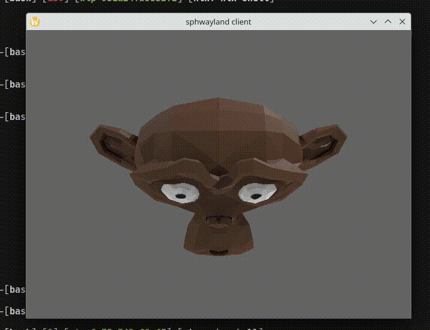

# sphwayland-client

A wayland client written with the intent of understanding the linux graphics
stack a little better

## Demo

## Details
Implementation is written without libwayland, we generate zig code from the
protocol XML ourselves and talk to the compositor manually. Because we do not
use libwayland, we cannot initialize an opengl context in the normal way with
egl. Instead we create a surfaceless rendering context and manually manage
framebuffers and dma-buf handles
